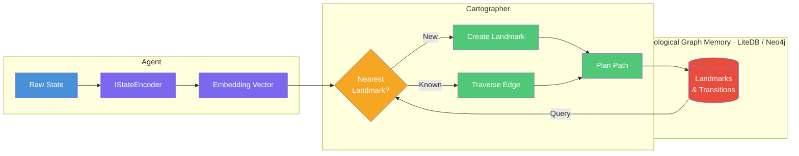
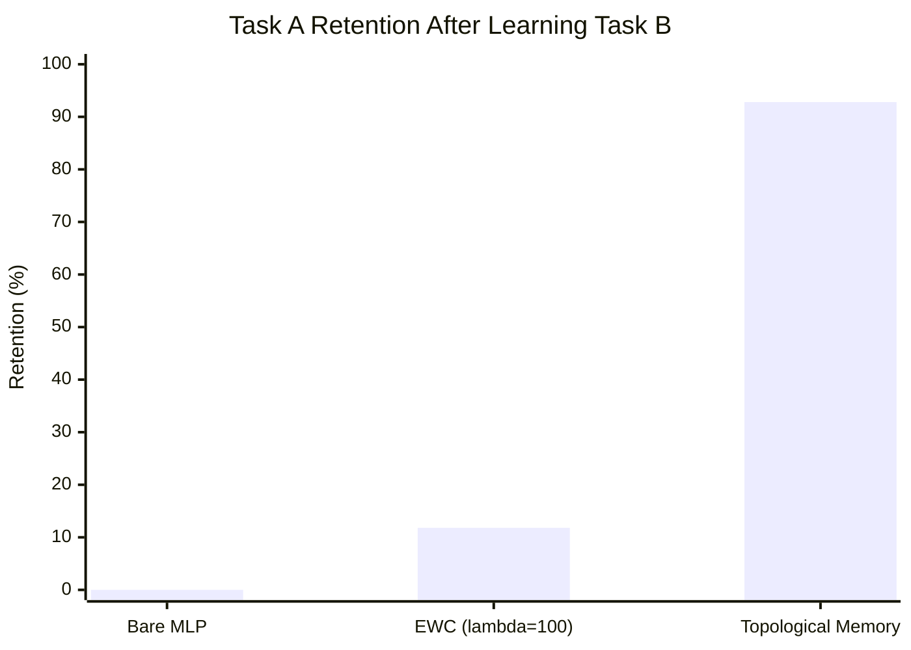
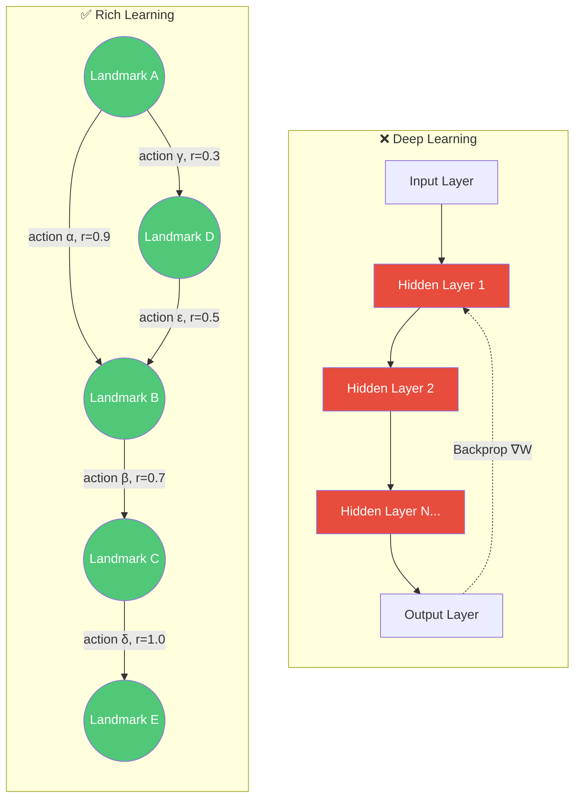

# Rich Learning: Topological Graph Memory for Lifelong RL

[](https://doi.org/10.5281/zenodo.18565288)


**Author:** Nasser Towfigh  
**License:** [Apache 2.0](LICENSE)  
**Version:** 1.0.0  
**Status:** Published Reference Implementation

## 📖 What is Rich Learning?
**Rich Learning** is a reinforcement learning paradigm focused on the accumulation of persistent knowledge assets rather than transient weight optimization.

In standard Deep RL, an agent "lives paycheck to paycheck"—often overwriting neural weights to learn new tasks (catastrophic forgetting). **Rich Learning** agents accumulate a **Topological Graph Memory**—a navigable map of the policy-state space stored in a graph database. New experiences *add to* the graph; they never degrade existing structure.

> **New:** The default backend is now **LiteDB** (embedded, zero-setup). No Neo4j server required — just `dotnet run` and go. Neo4j remains available as an optional backend for production-scale graphs.

## 🚀 Key Innovations
This repository contains the reference implementation of the **Rich Learning** architecture, featuring:

* **Topological Graph Memory:** Knowledge is stored as navigable "Landmarks" and "Transitions" in a graph database, not just neural weights.
* **Zero Forgetting:** New experiences add nodes and edges; they do not modify existing graph structure.
* **Explainable Plans:** Navigation through named landmarks, fully auditable.
* **Zero Setup:** LiteDB embedded backend — no Docker, no server, single `.db` file. Just `dotnet run`.
* **C# / .NET 10:** Implemented in pure C# with zero Python dependencies, achieving ~30–50× performance gains in RL inner loops.

### 🏗️ Architecture


```mermaid
graph LR
    subgraph Agent
        A[Raw State] --> B[IStateEncoder]
        B --> C[Embedding Vector]
    end

    subgraph Cartographer
        C --> D{Nearest\nLandmark?}
        D -->|New| E[Create Landmark]
        D -->|Known| F[Traverse Edge]
        E --> G[Plan Path]
        F --> G
    end

    subgraph "Topological Graph Memory · LiteDB / Neo4j"
        G --> H[(Landmarks\n& Transitions)]
        H -->|Query| D
    end

    style A fill:#4a90d9,color:#fff
    style B fill:#7b68ee,color:#fff
    style C fill:#7b68ee,color:#fff
    style D fill:#f5a623,color:#fff
    style E fill:#50c878,color:#fff
    style F fill:#50c878,color:#fff
    style G fill:#50c878,color:#fff
    style H fill:#e74c3c,color:#fff
```

## 📊 Experimental Results

We validate on two continual learning benchmarks where standard MLPs catastrophically forget.
All results below are reproducible — run `dotnet run -- SplitMnist --litedb` or `dotnet run -- SplitAudio --litedb`.

| Benchmark | Method | Task A Accuracy | After Task B | Retention |
| :--- | :--- | :--- | :--- | :--- |
| **Split-MNIST** | Bare MLP | 97.9% | 0.0% | 0.0% |
| | EWC (λ=100) | 97.9% | 11.5% | 11.8% |
| | **Topological Memory** | 91.7% | **85.2%** | **92.8%** |
| **Split-Audio** | Bare MLP | 39.5% | 0.0% | 0.0% |
| (FSD50K) | EWC (λ=100) | 39.5% | 0.0% | 0.0% |
| | **Topological Memory** | 50.3% | **50.3%** | **100.0%** |

*The topological graph retains Task A knowledge after training fully on Task B — the MLP forgets completely.*


```mermaid
xychart-beta
    title "Task A Retention After Learning Task B"
    x-axis ["Bare MLP", "EWC (lambda=100)", "Topological Memory"]
    y-axis "Retention (%)" 0 --> 100
    bar [0, 11.8, 92.8]
```

## 📄 Read the Paper
[**Download the Full Research Paper (PDF)**](paper/Rich-Learning-Paper.pdf)  
*Abstract: We introduce Rich Learning, a reinforcement learning paradigm that addresses catastrophic forgetting through topological graph memory...*

## 🛠️ Tech Stack
* **Language:** C# / .NET 10 (Zero Python dependencies)
* **Database:** LiteDB (default, embedded) · Neo4j (optional, server-based)
* **Core Interfaces:** `IGraphMemory`, `IStateEncoder`, `IConsonanceChecker<T>`, `IPassiveManifold`, `IActiveManifold`
* **Engine:** `DapsaEngine` (DAPSA loop), `Cartographer` (mid-level planning), `Fossilizer` (skill extraction)
* **Visualization:** Built-in browser-based graph explorer (`dotnet run -- Explore --litedb`)

## ⚡ Architectural Note: No Hidden Layers

Unlike traditional Deep Learning approaches that rely on opaque hidden layers and computationally expensive backpropagation, **Rich Learning** operates without hidden layers.

By offloading intelligence into explicit graph topology rather than neural weights, this paradigm achieves:

* **Transparency:** Every decision path is traceable through named landmarks and edges.
* **Energy Efficiency:** Inference is reduced to graph traversal (O(1) per hop) rather than matrix multiplication (O(N²)), resulting in a fraction of the energy consumption typical of Deep Neural Networks.
* **Suitability for Edge:** Ideal for low-power, battery-operated devices where thermal limits and battery life are critical.


```mermaid
graph TB
    subgraph "❌ Deep Learning"
        direction TB
        I1[Input Layer] --> H1[Hidden Layer 1]
        H1 --> H2[Hidden Layer 2]
        H2 --> H3[Hidden Layer N...]
        H3 --> O1[Output Layer]
        O1 -.->|Backprop ∇W| H1
        style H1 fill:#e74c3c,color:#fff
        style H2 fill:#e74c3c,color:#fff
        style H3 fill:#e74c3c,color:#fff
    end

    subgraph "✅ Rich Learning"
        direction TB
        S1((Landmark A)) -->|action α, r=0.9| S2((Landmark B))
        S2 -->|action β, r=0.7| S3((Landmark C))
        S1 -->|action γ, r=0.3| S4((Landmark D))
        S3 -->|action δ, r=1.0| S5((Landmark E))
        S4 -->|action ε, r=0.5| S2
        style S1 fill:#50c878,color:#fff
        style S2 fill:#50c878,color:#fff
        style S3 fill:#50c878,color:#fff
        style S4 fill:#50c878,color:#fff
        style S5 fill:#50c878,color:#fff
    end
```

## ⚡ Quick Start

```bash
# Prerequisites: .NET 10 SDK (that's it!)

# Clone and build
git clone https://github.com/Minu476/rich-learning.git
cd rich-learning/src/RichLearning
dotnet build

# Run Split-MNIST with LiteDB (default — no server needed)
dotnet run -- SplitMnist --litedb

# Run Split-Audio with LiteDB
dotnet run -- SplitAudio --litedb

# Compare LiteDB vs Neo4j (Neo4j optional)
dotnet run -- Compare

# C# performance benchmark
dotnet run -- Benchmark

# Interactive graph exploration demo
dotnet run -- Demo --litedb
```

<details>
<summary>🔧 Using Neo4j instead (optional)</summary>

```bash
# Start Neo4j
docker run -p 7474:7474 -p 7687:7687 -e NEO4J_AUTH=neo4j/password neo4j

# Run without --litedb to use Neo4j
NEO4J_URI="bolt://localhost:7687" NEO4J_USER="neo4j" NEO4J_PASSWORD="password" \
  dotnet run -- SplitMnist
```
</details>

## 📂 Project Structure

```
rich-learning/
├── src/RichLearning/
│   ├── Abstractions/          # Core interfaces (IGraphMemory, IStateEncoder, IDapsa, ...)
│   ├── Models/                # StateLandmark, StateTransition, Pattern, MapSnapshot
│   ├── Encoders/              # DefaultStateEncoder (cosine-distance embedding)
│   ├── Engine/                # DapsaEngine (DAPSA continual RL loop)
│   ├── Memory/                # InMemoryGraphMemory, LiteDbGraphMemory, Neo4jGraphMemory
│   ├── Learning/              # Fossilizer, MetaHierarchy, AgentEfficiencyTracker
│   ├── Planning/              # Cartographer, MetaLevelBuilder
│   ├── Visualization/         # GraphExplorerServer (browser-based graph viewer)
│   └── PoC/
│       ├── SplitMnist/        # Catastrophic forgetting on real MNIST digits
│       └── SplitAudio/        # Catastrophic forgetting on FSD50K audio features
├── tests/RichLearning.Tests/  # xUnit tests
├── data/                      # Pre-extracted features
├── paper/                     # Research paper PDF
├── scripts/                   # Data preparation scripts
├── VERSION.json               # Version alignment manifest
└── README.md
```

## 🔌 Extend Rich Learning

### Custom State Encoder
```csharp
public class MyEncoder : IStateEncoder
{
    public int EmbeddingDimension => 128;
    public double[] Encode(double[] raw) => MyTransform(raw);
    public double Distance(double[] a, double[] b) => CosineDistance(a, b);
}
```

### Alternative Graph Backend
Two backends are included: **LiteDB** (embedded, default) and **Neo4j** (server-based).  
Implement `IGraphMemory` for SQLite, Redis, or in-memory graphs.

### New PoC
Add a folder under `PoC/` with a static `RunAsync` method — the pattern is self-documenting.

## 🔗 Citation
If you use this methodology, please cite:

> Towfigh, N. (2026). *Rich Learning: Topological Graph Memory for Lifelong Reinforcement Learning*. GitHub. https://github.com/Minu476/rich-learning

## 📋 What's New in v1.0.0

This release represents a significant refinement of the Rich Learning interfaces and architecture:

* **Refined Interface Contracts:** `IConsonanceChecker<T>` simplified to a single type parameter. `IGraphMemory` expanded with graph pruning operations (`RemoveLandmarkAsync`, `RemoveTransitionAsync`) for memory decay and consolidation.
* **Pattern Clustering:** `Pattern.ClusterKey` enables explicit cluster assignment for meta-level hierarchy construction.
* **State Encoder Namespace:** `DefaultStateEncoder` moved to `RichLearning.Encoders` — cleaner separation between abstractions and implementations.
* **DapsaEngine Enhancements:** Configurable `discountFactor`, `FossilLookupRadius`, and `SynthesizeMetaGraphAsync` for meta-level graph construction.
* **Agent Efficiency Tracking:** `AgentEfficiencyTracker` with `RankAgents()` for multi-agent tier ranking.
* **Graph Explorer:** Interactive browser-based visualisation of the topological memory (`dotnet run -- Explore --litedb`).
* **Version Tracking:** `VERSION.json` manifest tracks interface alignment and changelog.
* **Full Test Suite:** 50 xUnit tests covering graph memory, trajectory DAGs, fossilisation, and engine contracts.

## ⚖️ License & IP
This project is licensed under **Apache License 2.0**.
* **Code:** You are free to use, modify, and distribute this software.
* **Patents:** This license grants an explicit patent grant for the *specific implementation* provided here.
