<div align="center">

# Rich Learning

### 100% knowledge retention. Zero hidden layers. One graph.

[](https://doi.org/10.5281/zenodo.18565288)
[](https://dotnet.microsoft.com/)
[](LICENSE)
[](https://richlearning.ai)
[]()
[](CONTRIBUTING.md)

**Topological Graph Memory for Lifelong Reinforcement Learning**

[Paper](paper/Rich-Learning-Paper.pdf) · [Website](https://richlearning.ai) · [Docs](https://richlearning.ai/docs/) · [Quick Start](#-quick-start) · [Contributing](CONTRIBUTING.md)

</div>

---

> **What if your RL agent never forgot anything it learned?**
>
> Standard Deep RL agents "live paycheck to paycheck" — overwriting neural weights to learn new tasks, destroying everything they knew before. Rich Learning agents build a **persistent topological map** of the state space. New experiences *add to* the graph; they never degrade existing structure. The result: **100% retention** on Split-MNIST, compared to 0% for bare MLPs and 19.5% for EWC.

## 📖 What is Rich Learning?

**Rich Learning** is a reinforcement learning paradigm that replaces mutable weight matrices with a navigable **Topological Graph Memory** — landmarks (nodes) and transitions (edges) stored in a graph database. Knowledge accumulates like a growing map, not a rewritable notebook.

- **Zero forgetting** — new tasks add subgraphs, existing structure is untouched
- **Explainable** — every decision traces through named landmarks and edges
- **Energy efficient** — graph traversal O(1) per hop, not matrix multiplication O(N²)
- **Edge-device ready** — no GPU, no Python, single `.db` file
- **Zero setup** — LiteDB embedded backend, just `dotnet run` and go

> Neo4j remains available as an optional backend for production-scale graphs.

## 🏗️ Architecture


## 📊 Experimental Results (from Paper)

We validate on two continual learning benchmarks where standard MLPs catastrophically forget:

| Benchmark | Method | Task A Accuracy | After Task B | Retention |
| :--- | :--- | :--- | :--- | :--- |
| **Split-MNIST** | Bare MLP | 97.9% | 0.0% | 0.0% |
| | EWC (λ=100) | 97.9% | 19.1% | 19.5% |
| | **Topological Memory** | 85.2% | **85.2%** | **100.0%** |
| **Split-Audio** | Bare MLP | — | — | ~0% |
| (FSD50K) | **Topological Memory** | — | — | **100.0%** |

*The topological graph retains 100% of Task A landmarks after training fully on Task B.*


## 📄 Read the Paper
[**Download the Full Research Paper (PDF)**](paper/Rich-Learning-Paper.pdf)  
*Abstract: We introduce Rich Learning, a reinforcement learning paradigm that addresses catastrophic forgetting through topological graph memory...*

## 🛠️ Tech Stack
* **Language:** C# 12 / .NET 10 (Zero Python dependencies)
* **Database:** LiteDB (default, embedded) · Neo4j (optional, server-based)
* **Interfaces:** IGraphMemory, IStateEncoder, IExplorationStrategy, Cartographer

## ⚡ Architectural Note: No Hidden Layers

Unlike traditional Deep Learning approaches that rely on opaque hidden layers and computationally expensive backpropagation, **Rich Learning** operates without hidden layers.

By offloading intelligence into explicit graph topology rather than neural weights, this paradigm achieves:

* **Transparency:** Every decision path is traceable through named landmarks and edges.
* **Energy Efficiency:** Inference is reduced to graph traversal (O(1) per hop) rather than matrix multiplication (O(N²)), resulting in a fraction of the energy consumption typical of Deep Neural Networks.
* **Suitability for Edge:** Ideal for low-power, battery-operated devices where thermal limits and battery life are critical.

```mermaid
graph TB
    subgraph "❌ Deep Learning"
        direction TB
        I1[Input Layer] --> H1[Hidden Layer 1]
        H1 --> H2[Hidden Layer 2]
        H2 --> H3[Hidden Layer N...]
        H3 --> O1[Output Layer]
        O1 -.->|Backprop ∇W| H1
        style H1 fill:#e74c3c,color:#fff
        style H2 fill:#e74c3c,color:#fff
        style H3 fill:#e74c3c,color:#fff
    end

    subgraph "✅ Rich Learning"
        direction TB
        S1((Landmark A)) -->|action α, r=0.9| S2((Landmark B))
        S2 -->|action β, r=0.7| S3((Landmark C))
        S1 -->|action γ, r=0.3| S4((Landmark D))
        S3 -->|action δ, r=1.0| S5((Landmark E))
        S4 -->|action ε, r=0.5| S2
        style S1 fill:#50c878,color:#fff
        style S2 fill:#50c878,color:#fff
        style S3 fill:#50c878,color:#fff
        style S4 fill:#50c878,color:#fff
        style S5 fill:#50c878,color:#fff
    end
```



## 💎 Why C#?

Most RL research defaults to Python — so why C#?

| | Python (typical RL) | C# / .NET (Rich Learning) |
|:---|:---|:---|
| **Inner-loop speed** | Interpreted, GIL-bound | JIT-compiled, 30–50× faster |
| **Memory safety** | Manual GC tuning | Deterministic `IAsyncDisposable` |
| **Type safety** | Runtime errors | Compile-time guarantees |
| **Deployment** | pip + conda + Docker | Single `dotnet publish` binary |
| **Edge devices** | Needs Python runtime | Self-contained, no runtime needed |
| **Async I/O** | asyncio (bolted on) | Native `async/await` since v1 |
| **GPU required** | Almost always | Never — graph traversal only |

Rich Learning's core operation is **graph traversal**, not matrix multiplication. C#/.NET gives us type-safe, fast, memory-efficient graph operations with zero Python overhead. The result: an RL agent that runs on a Raspberry Pi and benchmarks 30–50× faster than equivalent Python RL inner loops.

> *"We chose C# not despite being an RL project, but because of it. When your algorithm is topology, not tensors, you want a systems language — not a scripting one."*

## ⚡ Quick Start

```bash
# Prerequisites: .NET 10 SDK (that's it!)

# Clone and build
git clone https://github.com/Minu476/rich-learning.git
cd rich-learning/src/RichLearning
dotnet build

# Run Split-MNIST with LiteDB (default — no server needed)
dotnet run -- SplitMnist --litedb

# Run Split-Audio with LiteDB
dotnet run -- SplitAudio --litedb

# Compare LiteDB vs Neo4j (Neo4j optional)
dotnet run -- Compare

# C# performance benchmark
dotnet run -- Benchmark

# Interactive graph exploration demo
dotnet run -- Demo --litedb
```

<details>
<summary>🔧 Using Neo4j instead (optional)</summary>

```bash
# Start Neo4j
docker run -p 7474:7474 -p 7687:7687 -e NEO4J_AUTH=neo4j/password neo4j

# Run without --litedb to use Neo4j
NEO4J_URI="bolt://localhost:7687" NEO4J_USER="neo4j" NEO4J_PASSWORD="password" \
  dotnet run -- SplitMnist
```
</details>

## 📂 Project Structure

```
rich-learning/
├── src/RichLearning/
│   ├── Abstractions/          # Interfaces (IGraphMemory, IStateEncoder, ...)
│   ├── Models/                # StateLandmark, StateTransition, SubgoalDirective
│   ├── Memory/                # LiteDbGraphMemory (default) + Neo4jGraphMemory
│   ├── Planning/              # Cartographer (mid-level planner)
│   └── PoC/
│       ├── SplitMnist/        # Catastrophic forgetting on MNIST digits
│       └── SplitAudio/        # Catastrophic forgetting on FSD50K audio
├── data/                      # Pre-extracted features (gitignored for large files)
├── paper/                     # Research paper PDF
├── scripts/                   # Data preparation scripts
└── README.md
```

## 🔌 Extend Rich Learning

### Custom State Encoder
```csharp
public class MyEncoder : IStateEncoder
{
    public int EmbeddingDimension => 128;
    public double[] Encode(double[] raw) => MyTransform(raw);
    public double Distance(double[] a, double[] b) => CosineDistance(a, b);
}
```

### Alternative Graph Backend
Two backends are included: **LiteDB** (embedded, default) and **Neo4j** (server-based).  
Implement `IGraphMemory` for SQLite, Redis, or in-memory graphs.

### New PoC
Add a folder under `PoC/` with a static `RunAsync` method — the pattern is self-documenting.

## 🔗 Citation
If you use this methodology, please cite:

> Towfigh, N. (2026). *Rich Learning: Topological Graph Memory for Lifelong Reinforcement Learning*. GitHub. https://github.com/Minu476/rich-learning

## ⚖️ License & IP
This project is licensed under **Apache License 2.0**.
* **Code:** You are free to use, modify, and distribute this software.
* **Patents:** This license grants an explicit patent grant for the *specific implementation* provided here.

---

<div align="center">

**Built by [Nasser Towfigh](https://github.com/Minu476)**

If this project is useful to you, please consider giving it a ⭐

[Report Bug](https://github.com/Minu476/rich-learning/issues/new?template=bug_report.md) · [Request Feature](https://github.com/Minu476/rich-learning/issues/new?template=feature_request.md)

</div>
